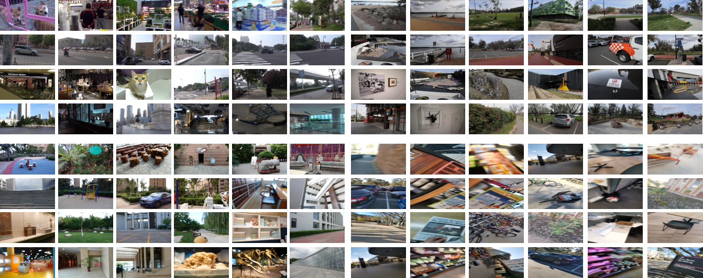

# MC-Blur: A Comprehensive Benchmark for Image Deblurring




## Our propsoed MC-Blur Benchmark


We construct a large-scale multi-cause (MC-Blur) dataset for image deblurring.  It consists of four blur types: uniform blurs, motion blurs by averaging continuous frames, heavy defocus blurs, and real-world blurs. We collect these images from more than 1000 diverse scenes such as buildings, city scenes, vehicles, natural landscapes, people, animals, and sculptures. MC-Blur Benchmark consits of four different subsets, i.e., Real high-fps based Motion-blurred subset (RHM), large-kernel UHD Motion-blurred subset (UHDM),  large-scale heavy defocus blurred subset (LSD), and Real Mixed Blurry Qualitative subset (RMBQ).


## Downloads

The images of the dataset can be downloaded from the links below. 

### Google Drive
- [RHM-250](https://drive.google.com/file/d/1hoCFNeP1GOszaJfLABBw35hCQQKWPMhV/view?usp=sharing) (6.2G for test)
- [RHM-500](https://drive.google.com/file/d/13payJmIY6mssFXMSuOwf1aosA3n6bXb6/view?usp=sharing)  (7.1G for test)
- [RHM-1000](https://drive.google.com/file/d/1HJqV6Ogve-G6YGYJDH7MD5nKAQOTnVMG/view?usp=sharing)  (9.3G for test)
- [RHM-250-500-1000](https://drive.google.com/file/d/1V9Ac0Bw9wdoo50y8JM0F4VVh1jNGTP6m/view?usp=sharing) (117G total data) 
- [UHDM](https://drive.google.com/file/d/1qToTBej21VC7n49L_36FjmuQisjM3xPf/view?usp=sharing) (278G total data) 
- [LSD](https://drive.google.com/file/d/19C56VIxChcvcCylKpAlK1pqYo16c0D_k/view?usp=sharing) (34G total data)
- [RMBQ](https://drive.google.com/file/d/1ydAuaPy8uh_s3yk0G9raEYyC7z8BGvMl/view?usp=sharing) (110G total data)

### Baidu Cloud
- [RHM-250-500-1000](https://pan.baidu.com/s/18iwSYoERjPSLARlhxpbVzg) (117G total data) (password:ohzp)
- [UHDM](https://pan.baidu.com/s/1pG9kAo4v9n5LTMvmLpjZZg) (278G total data) (password:p78n)
- [LSD](https://pan.baidu.com/s/10-kLWGKJZQ5TQH5vUMcsyA) (34G total data) (password:sbtu)
- [RMBQ](https://pan.baidu.com/s/1_0drJkbIJ6X_GBseybHpeA) (110G total data) (password:nwq8)

### Download MC-Blur benchmark from the script, run

```
python download_data.py
```
**Note:** The above script will download all subsets of the MC-Blur. You can use "--data" to select. 
For example:
```
python download_data.py --data "UHDM_train_test"
```
## Some visual examples of MC-Blur Dataset

[Visual examples](instruction/README.md) for each subset of our MC-Blur Dataset.

## Benchmarking Study

## Methods

|Date|Publication|Title|Abbreviation|Code|Platform|
|---|---|---|---|---|---|
|2017|CVPR|Deep multi-scale convolutional neural network for dynamic scene deblurring [paper](http://zpascal.net/cvpr2017/Nah_Deep_Multi-Scale_Convolutional_CVPR_2017_paper.pdf)|DeepDeblur|[Code](https://github.com/SeungjunNah/DeepDeblur_release)|Pytorch|
|2018|CVPR|Deblurgan: Blind motion deblurring using conditional adversarial networks [paper](http://openaccess.thecvf.com/content_cvpr_2018/html/Kupyn_DeblurGAN_Blind_Motion_CVPR_2018_paper.html)|DeblurGAN|[Code](https://github.com/KupynOrest/DeblurGAN)|Pytorch|
|2018|CVPR|Scale-recurrent network for deep image deblurring [paper](http://openaccess.thecvf.com/content_cvpr_2018/html/Tao_Scale-Recurrent_Network_for_CVPR_2018_paper.html)|SRN|[Code](https://github.com/jiangsutx/SRN-Deblur)|Tensorflow|
|2019|ICCV|DeblurGAN-v2: Deblurring (Orders-of-Magnitude) Faster and Better [paper](https://arxiv.org/abs/1908.03826)|DeblurGAN-v2|[Code](https://github.com/TAMU-VITA/DeblurGANv2)|Pytorch|
|2019|CVPR| Deep Stacked Hierarchical Multi-Patch Network for Image Deblurring [paper](http://openaccess.thecvf.com/content_CVPR_2019/html/Zhang_Deep_Stacked_Hierarchical_Multi-Patch_Network_for_Image_Deblurring_CVPR_2019_paper.html)|DMPHN|[Code](https://github.com/HongguangZhang/DMPHN-cvpr19-master)|Pytorch|
|2020|CVPR| Deblurring by Realistic Blurring [paper](https://openaccess.thecvf.com/content_CVPR_2020/papers/Zhang_Deblurring_by_Realistic_Blurring_CVPR_2020_paper.pdf)|DBGAN|[Code](https://github.com/HDCVLab/Deblurring-by-Realistic-Blurring)|Pytorch|
|2021|CVPR|Multi-Stage Progressive Image Restoration [paper](https://arxiv.org/pdf/2102.02808.pdf)|MPRNet| [Code](https://github.com/swz30/MPRNet)|Pytorch|
|2022|CVPR|Restormer: Efficient Transformer for High-Resolution Image Restoration [paper](https://arxiv.org/pdf/2111.09881.pdf?ref=https://githubhelp.com)|Restormer| [Code](https://github.com/swz30/Restormer)|Pytorch|
|2021|ICCV|Rethinking Coarse-To-Fine Approach in Single Image Deblurring [paper](https://openaccess.thecvf.com/content/ICCV2021/html/Cho_Rethinking_Coarse-To-Fine_Approach_in_Single_Image_Deblurring_ICCV_2021_paper.html)|MIMO-UNet| [Code](https://github.com/chosj95/mimo-unet)|Pytorch|


## Metrics

|Abbreviation|Full-/Non-Reference|Platform|Code|
|---|---|---|---|
|PSNR (Peak Signal-to-Noise Ratio)|Full-Reference| | |
|SSIM (Structural Similarity Index Measurement)|Full-Reference|MATLAB|[Code](http://www.cns.nyu.edu/~lcv/ssim/ssim_index.m) |
|NIQE (Naturalness Image Quality Evaluator)|Non-Reference|MATLAB|[Code](https://github.com/utlive/niqe)|
|SSEQ (No-reference Image Quality Assessment Based on Spatial and Spectral Entropies)|Non-Reference|MATLAB|[Code](https://github.com/OaDsis/No-Reference-IQA)|


### Results for 250-fps images from RHM Set 

|Method|PSNR|SSIM|Parameter|
|-|-|-|-|
|[DeepDeblur](https://github.com/SeungjunNah/DeepDeblur_release)|30.38|0.8766|11.72 M|
|[DeblurGAN](https://github.com/KupynOrest/DeblurGAN)|24.89|0.6364|6.07 M|
|[SRN](https://github.com/jiangsutx/SRN-Deblur)|30.57|0.8799|6.88 M|
|[DeblurGAN-v2](https://github.com/TAMU-VITA/DeblurGANv2)|26.99|0.8061|7.84 M|
|[DMPHN](https://github.com/HongguangZhang/DMPHN-cvpr19-master)|30.42|0.8768|21.69 M|
|[DBGAN](https://github.com/HDCVLab/Deblurring-by-Realistic-Blurring)|27.89|0.8191|11.59 M|
|[MPRNet](https://github.com/swz30/MPRNet)|31.52|0.9239|20.13 M|
|[Restormer](https://github.com/swz30/Restormer)|30.41|0.9106|26.10 M|
|[MIMO-UNet](https://github.com/chosj95/mimo-unet)|32.02|0.9285|6.81 M|

### Results for 500-fps images from RHM Set 

|Method|PSNR|SSIM|Parameter|
|-|-|-|-|
|[DeepDeblur](https://github.com/SeungjunNah/DeepDeblur_release)|31.08|0.8974|11.72 M|
|[DeblurGAN](https://github.com/KupynOrest/DeblurGAN)|24.66|0.6748|6.07 M|
|[SRN](https://github.com/jiangsutx/SRN-Deblur)|31.54|0.9051|6.88 MB|
|[DeblurGAN-v2](https://github.com/TAMU-VITA/DeblurGANv2)|27.67|0.8320|7.84 M|
|[DMPHN](https://github.com/HongguangZhang/DMPHN-cvpr19-master)|31.43|0.9018|21.69 M|
|[DBGAN](https://github.com/HDCVLab/Deblurring-by-Realistic-Blurring)|28.36|0.8388|11.59 M|
|[MPRNet](https://github.com/swz30/MPRNet)|32.08|0.9300|20.13 M|
|[Restormer](https://github.com/swz30/Restormer)|30.98|0.9160|26.10 M|
|[MIMO-UNet](https://github.com/chosj95/mimo-unet)|32.89|0.9398|6.81 M|

### Results for 1000-fps images from RHM Set

|Method|PSNR|SSIM|Parameter|
|-|-|-|-|
|[DeepDeblur](https://github.com/SeungjunNah/DeepDeblur_release)|32.41|0.8966|11.72 M|
|[DeblurGAN](https://github.com/KupynOrest/DeblurGAN)|25.20|0.6535|6.07 M|
|[SRN](https://github.com/jiangsutx/SRN-Deblur)|32.69|0.0.9016|6.88 M|
|[DeblurGAN-v2](https://github.com/TAMU-VITA/DeblurGANv2)|29.81|0.8461|7.84 M|
|[DMPHN](https://github.com/HongguangZhang/DMPHN-cvpr19-master)|32.41|0.9096|21.69 M|
|[DBGAN](https://github.com/HDCVLab/Deblurring-by-Realistic-Blurring)|29.66|0.8318|11.59 M|
|[MPRNet](https://github.com/swz30/MPRNet)|33.36|0.9332|20.13 M|
|[Restormer](https://github.com/swz30/Restormer)|32.77|0.9264|26.10 M|
|[MIMO-UNet](https://github.com/chosj95/mimo-unet)|33.75|0.9360|6.81 M|


### Results on UHDM Set

|Method|PSNR|SSIM|Parameter|
|-|-|-|-|
|[DeepDeblur](https://github.com/SeungjunNah/DeepDeblur_release)|22.23|0.6322|11.72 M|
|[DeblurGAN](https://github.com/KupynOrest/DeblurGAN)|20.39|0.5568|6.07 M|
|[SRN](https://github.com/jiangsutx/SRN-Deblur)|22.28|0.6346|6.88 M|
|[DeblurGAN-v2](https://github.com/TAMU-VITA/DeblurGANv2)|21.03|0.5839|7.84 M|
|[DMPHN](https://github.com/HongguangZhang/DMPHN-cvpr19-master)|22.20|0.6378|21.69 M|
|[DBGAN](https://github.com/HDCVLab/Deblurring-by-Realistic-Blurring)|21.52|0.6025|11.59 M|
|[MPRNet](https://github.com/swz30/MPRNet)|23.70|0.7472|20.13 M|
|[Restormer](https://github.com/swz30/Restormer)|22.39|0.7356|26.10 M|
|[MIMO-UNet](https://github.com/chosj95/mimo-unet)|22.97|0.7317|6.81 M|

### Results on LSD Set

|Method|PSNR|SSIM|Parameter|
|-|-|-|-|
|[DeepDeblur](https://github.com/SeungjunNah/DeepDeblur_release)|20.73|0.7218|11.72 M|
|[DeblurGAN](https://github.com/KupynOrest/DeblurGAN)|20.04|0.6335|6.07 M|
|[SRN](https://github.com/jiangsutx/SRN-Deblur)|21.66|0.7664|6.88 M|
|[DeblurGAN-v2](https://github.com/TAMU-VITA/DeblurGANv2)|21.13|0.6964|7.84 M|
|[DMPHN](https://github.com/HongguangZhang/DMPHN-cvpr19-master)|21.23|0.7519|21.69 M|
|[DBGAN](https://github.com/HDCVLab/Deblurring-by-Realistic-Blurring)|21.56|0.7536|11.59 M|
|[MPRNet](https://github.com/swz30/MPRNet)|21.32|0.7897|20.13 M|
|[Restormer](https://github.com/swz30/Restormer)|22.35|0.8072|26.10 M|
|[MIMO-UNet](https://github.com/chosj95/mimo-unet)|22.56|0.7985|6.81 M|


## Citation
If you think this work is useful for your research, please cite the following paper.

```
@inproceedings{zhang2021benchmarking,
  title={MC-Blur: A Comprehensive Benchmark for Image Deblurring},
  author={Zhang, Kaihao and Wang, Tao and Luo, Wenhan and Chen, Boheng and Ren, Wenqi and Stenger, Bjorn and Liu, Wei and Li, Hongdong and Yang Ming-Hsuan},
  booktitle={arXiv:2112.00234},
  year={2022}
}
```

### License

The MC-Blur dataset is released under [CC BY-NC-ND](https://creativecommons.org/licenses/by-nc-nd/4.0/) license.


